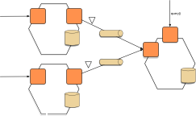

# Шаблон: Композиция API

[Оригинал](https://microservices.io/patterns/data/api-composition.html)

## Дано

Вы воспользовались шаблоном [Микросервисная архитектура](../Application-architecture-patterns/pattern-microservice-architecture.md) 
и шаблоном [По базе данных на сервис](database-per-service.md). В результате
реализовать запросы, объединяющие данные от нескольких сервисов, стало уже не
так просто.

## Хотите больше узнать об этом шаблоне?

Взгляните на мой [онлайн-учебный курс для самостоятельного изучения](https://chrisrichardson.net/virtual-bootcamp-distributed-data-management.html), который
научит вас использовать шаблоны Saga, Композиция API и CQRS для создания
операций, охватывающих несколько сервисов

Обычно стоимость курса составляет 395 долларов США на человека, но используя
купон WSSEULWL вы сможете зарегистрироваться за 190 долларов США (действителен
до 30 ноября 2022 г.)

## Задача

Как реализовать запросы в микросервисной архитектуре?

## Решение

Реализуйте запрос, определив _API Composer_ (_Объединитель API_), который
вызывает сервисы, владеющие данными, и выполняет объединение результатов 
в памяти.

## Пример

[API-шлюз](../External-API/api-gateway.md) часто осуществляет композицию API.

## Преимущества и недостатки

Этот шаблон имеет следующие преимущества:

* Это простой способ запроса данных в микросервисной архитектуре

Этот шаблон имеет следующие недостатки:

* Некоторые запросы могут привести к неэффективному объединению больших 
  наборов данных в памяти

## Связанные шаблоны

* Шаблон [По базе данных на сервис](database-per-service.md) создает
  необходимость использования этого шаблона
* [Шаблон CQRS](cqrs.md) является альтернативным решением

## Смотрите также

## Где можно получить более подробную информацию

* В моей книге [Микросервисы. Паттерны разработки и рефакторинга](https://microservices.io/book) этот
  шаблон описан более подробно
* Взгляните на мой [онлайн-учебный курс для самостоятельного изучения](https://chrisrichardson.net/virtual-bootcamp-distributed-data-management.html), который
  научит вас использовать шаблоны Saga, Композиция API и CQRS для создания
  операций, охватывающих несколько сервисов