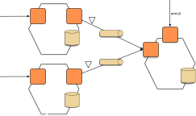
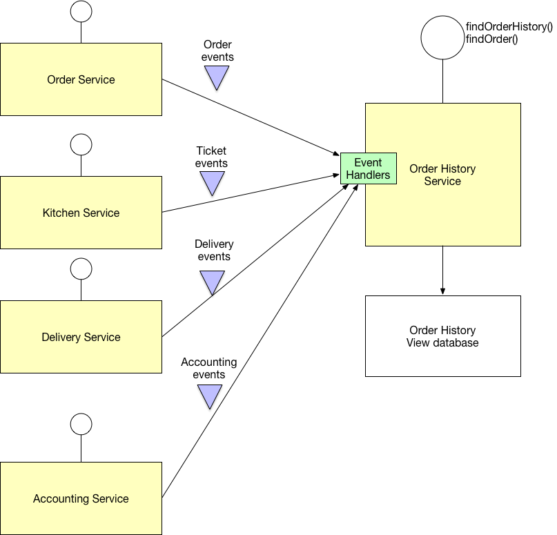

# Шаблон: Разделение ответственности команд и запросов (CQRS)

[Оригинал](https://microservices.io/patterns/data/cqrs.html)

## Дано

Вы воспользовались шаблоном [Микросервисная архитектура](../Application-architecture-patterns/pattern-microservice-architecture.md)
и шаблоном [По базе данных на сервис](database-per-service.md). В результате
реализовать запросы, объединяющие данные от нескольких сервисов, стало уже не
так просто. Кроме того, если вы использовали [шаблон Генерация событий](event-sourcing.md), данные 
уже нельзя будет легко получить.

## Хотите больше узнать об этом шаблоне?

Взгляните на мой [онлайн-учебный курс для самостоятельного изучения](https://chrisrichardson.net/virtual-bootcamp-distributed-data-management.html), который
научит вас использовать шаблоны Saga, Композиция API и CQRS для создания
операций, охватывающих несколько сервисов

Обычно стоимость курса составляет 395 долларов США на человека, но используя
купон WSSEULWL вы сможете зарегистрироваться за 190 долларов США (действителен
до 30 ноября 2022 г.)

## Задача

Как реализовать запрос, извлекающий данные из нескольких сервисов, в 
микросервисной архитектуре?

## Решение

Определите базу данных представлений, которая является доступной только 
для чтения репликой, предназначенной для поддержки этого запроса. Приложение 
поддерживает реплику в актуальном состоянии, подписываясь на [события 
предметной области](domain-event.md), публикуемые сервисом, которой 
принадлежат данные.

## Примеры

* Пример приложения FTGO из моей книги содержит [`Order History Service`](https://github.com/microservices-patterns/ftgo-application#chapter-7-implementing-queries-in-a-microservice-architecture), который
  реализует этот шаблон
* Существует [несколько примеров приложений на основе Eventuate](http://eventuate.io/exampleapps.html), иллюстрирующих 
  использование этого шаблона

## Преимущества и недостатки

Этот шаблон имеет следующие преимущества:

* Поддерживает множество денормализованных представлений, которые 
  являются масштабируемыми и производительными
* Улучшенное разделение понятий = более простые модели команд и запросов
* Необходим в архитектуре, основанной на событиях

Этот шаблон имеет следующие недостатки:

* Повышенная сложность
* Возможное дублирование кода
* Задержка репликации/представления, согласованные по событиям

## Связанные шаблоны

* Шаблон [По базе данных на сервис](database-per-service.md) создает
  необходимость использования этого шаблона
* [Шаблон Композиция API](api-composition.md) является альтернативным решением
* Шаблон [Событие предметной области](domain-event.md) генерирует события
* CQRS часто используется с [Генерацией событий](event-sourcing.md)

## Смотрите также

* [Eventuate](http://eventuate.io/) — платформа для разработки 
  транзакционных бизнес-приложений

## Где можно получить более подробную информацию

* В моей книге [Микросервисы. Паттерны разработки и рефакторинга](https://microservices.io/book) этот
  шаблон описан более подробно
* Взгляните на мой [онлайн-учебный курс для самостоятельного изучения](https://chrisrichardson.net/virtual-bootcamp-distributed-data-management.html), который
  научит вас использовать шаблоны Saga, Композиция API и CQRS для создания
  операций, охватывающих несколько сервисов