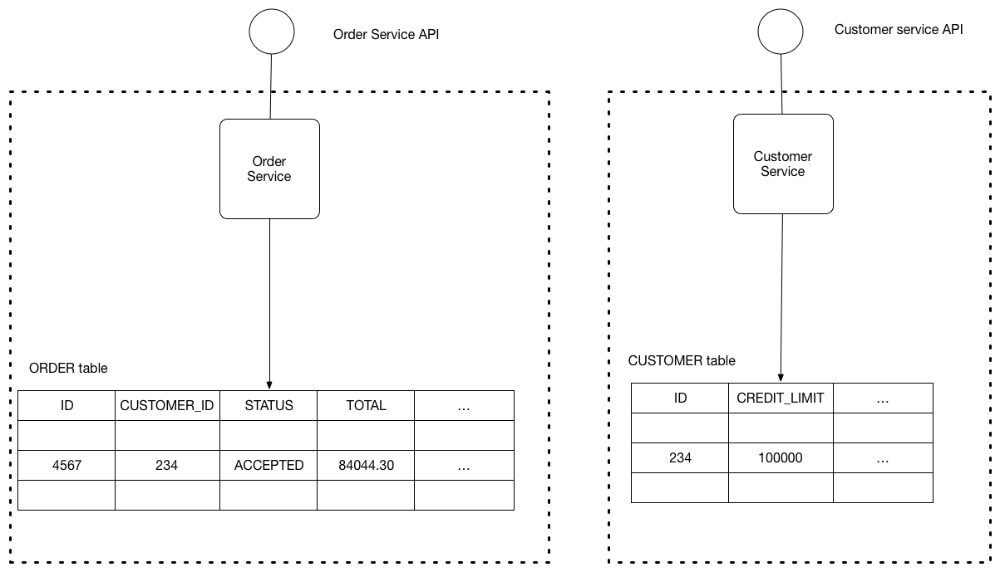

# Шаблон: По базе данных на сервис

[Оригинал](https://microservices.io/patterns/data/database-per-service.html)

## Дано

Давайте представим, что вы разрабатываете приложение для интернет-магазина с 
использованием [архитектурного шаблона «Микросервисы»](../Application-architecture-patterns/pattern-microservice-architecture.md). 
Большинству сервисов необходимо сохранять данные в какой-либо базе данных. 
Например, `Order Service` (Сервис для работы с заказами) хранит информацию 
о заказах, а `Customer Service` (Сервис для работы с клиентами) хранит 
информацию о клиентах.

## Задача

Какую архитектуру баз данных использовать в микросервисном приложении?

## Дополнительные условия

* Сервисы должны быть слабо связаны, чтобы их можно было разрабатывать, 
  развертывать и масштабировать независимо друг от друга
* Некоторые бизнес-транзакции должны накладывать инварианты, охватывающие 
  несколько сервисов. Например, для случая `Place Order` («Разместить заказ») 
  необходимо убедиться, что новый заказ не превысит кредитный лимит клиента. 
  Другие бизнес-транзакции должны обновлять данные, принадлежащие нескольким 
  сервисам.
* Некоторые бизнес-транзакции должны запрашивать данные, принадлежащие 
  нескольким сервисам. Например, для случая `View Available Credit` («Просмотреть 
  доступный кредит») необходимо осуществлять запрос к сервису 
  `Customer`, чтобы определить `creditLimit` (кредитный лимит) и `Orders` 
  для расчета общей суммы неоплаченных заказов.
* Некоторые запросы должны объединять данные, принадлежащие нескольким 
  сервисам. Например, для поиска клиентов в определенном регионе и их 
  последних заказов требуется осуществить объединение клиентов и заказов.
* Базы данных иногда необходимо реплицировать и сегментировать для 
  масштабирования. Смотри [куб масштабирования](../../Articles/scale-cube.md).
* Разные сервисы предъявляют разные требования к хранению данных. Для 
  некоторых сервисов реляционная база данных — наилучший выбор. Другим сервисам 
  может потребоваться NoSQL база данных, такая как MongoDB, которая хороша 
  для хранения сложных неструктурированных данных, или Neo4J, предназначенная
  для эффективного хранения и запроса данных в виде графов.

## Решение

Храните данные каждого микросервиса так, чтобы они были доступны другим через 
его API. Транзакции сервиса должны затрагивать только её базу данных.

На приведённой ниже диаграмме показана структура этого шаблона.

База данных сервиса фактически является частью реализации этого сервиса. 
Другие сервисы не могут получить к нему прямой доступ.

Существует несколько различных способов сделать так, чтобы данные сервиса
не были доступны другим. Вам не нужно выделять сервер базы данных для 
каждого сервиса. Например, если вы используете реляционную базу данных, 
возможны следующие варианты:

* Private-tables-per-service — у каждого сервиса есть набор таблиц, доступ к
  которым должен иметь только этот сервис.
* Schema-per-service – у каждого сервиса есть схема базы данных, которая 
  доступна только ей.
* Database-server-per-service – у каждого сервиса есть собственный сервер 
  базы данных.

Private-tables-per-service и schema-per-service приводят к наименьшим
накладным расходам. Использование схемы для каждого сервиса подкупает, 
поскольку делает более четким право собственности. Некоторым сервисам с 
высокой пропускной способностью может потребоваться собственный сервер 
базы данных.

Хорошей идеей является создание барьеров, поддерживающих эту модульность.
Вы можете, например, назначить разных пользователей базы данных для каждого
сервиса и использовать механизм управления доступом к базе данных, такой 
как гранты. Без какого-либо барьера для принудительной инкапсуляции у 
разработчиков всегда будет соблазн обойти API сервиса и получить прямой 
доступ к его данным.

## Пример

[Приложение FTGO](https://chrisrichardson.net/post/microservices/patterns/data/2019/07/15/ftgo-database-per-service.html) – пример 
приложения, использующего этот подход. У каждого сервиса есть учетные 
данные, которые предоставляют ему доступ только к своей собственной 
(логической) базе данных на общем сервере MySQL. Для получения 
дополнительной информации смотри этот [пост в блоге](https://chrisrichardson.net/post/microservices/patterns/data/2019/07/15/ftgo-database-per-service.html).

## Преимущества и недостатки

Использование базы данных для каждого сервиса имеет следующие преимущества:

* Помогает обеспечить слабую связанность сервисов. Изменения в базе данных 
  одного сервиса не влияют на другие сервисы.
* Каждый сервис может использовать тот тип базы данных, который лучше 
  всего подходит для его нужд. Например, сервис, выполняющий текстовый 
  поиск, может использовать ElasticSearch. Сервис, который манипулирует 
  социальным графом, может использовать Neo4j.

Использование базы данных для каждого сервиса имеет следующие недостатки:

* Реализация бизнес-транзакций, охватывающих несколько сервисов, непроста. 
  Распределенных транзакций лучше избегать из-за CAP теоремы. Более того, 
  многие современные (NoSQL) базы данных их не поддерживают.
* Реализация запросов, объединяющих данные, которые сейчас находятся в 
  нескольких базах данных, является сложной задачей.
* Сложность управления несколькими SQL и NoSQL базами данных.

Существуют различных шаблонов/решений для реализации транзакций и запросов, 
которые охватывают несколько сервисов:

* Реализация транзакций, охватывающих несколько сервисов — используйте 
  шаблон Saga.
* Реализация запросов, охватывающих несколько сервисов:
  * [Композиция API](api-composition.md) – объединение 
    выполняет приложение, а не база данных. Например, сервис (или API-шлюз) 
    может получить данные о клиенте и его заказах, сначала извлекая клиента 
    из сервиса для работы с клиентами, а затем обращаясь к сервису для 
    работы с заказами, чтобы вернуть самые последние заказы клиента.
  * [Разделение ответственности команд и запросов (CQRS)](cqrs.md) – поддержка одного 
    или нескольких материализованных представлений, содержащих данные из 
    нескольких сервисов. Представления формируются сервисами, которые 
    подписываются на события, публикуемые каждым сервисом при обновлении 
    своих данных. Например, интернет-магазин может реализовать запрос, 
    который находит клиентов в определенном регионе и их последние заказы, 
    поддерживая в актуальном виде представление, объединяющее клиентов и 
    заказы. Представление обновляется сервисом, который подписывается на 
    события от сервисов для работы с клиентами и заказами.

## Связанные шаблоны

* [Микросервисная архитектура](../Application-architecture-patterns/pattern-microservice-architecture.md) создает
  необходимость использования этого шаблона
* Шаблон [Saga](saga.md) — используется для реализации согласованных по событиям транзакций
* Шаблон [API Composition](api-composition.md) и [Command Query Responsibility Segregation (CQRS)](cqrs.md) — можно
  использовать для реализации запросов
* [Антишаблон «Общая база данных»]() описывает 
  проблемы, возникающие из-за совместного использования микросервисами одной 
  и той же базы данных