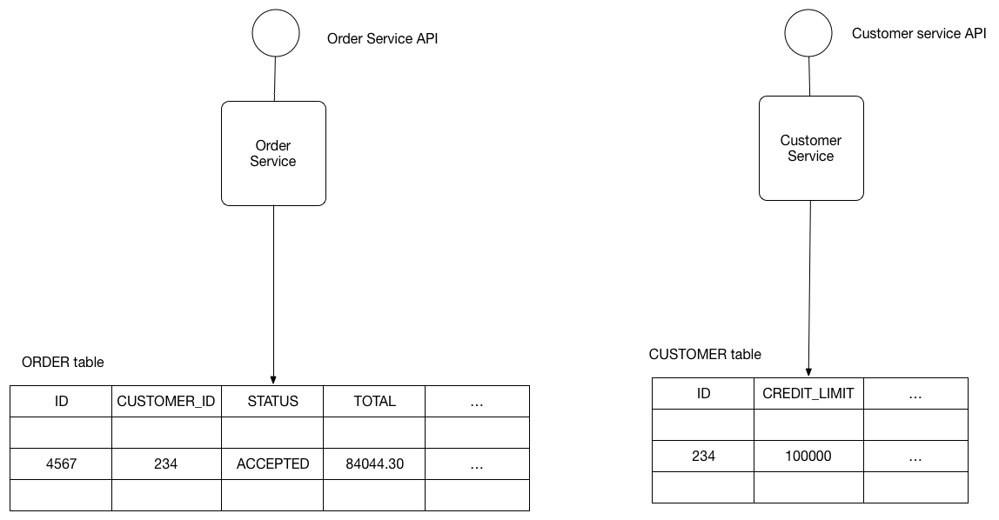

# Шаблон: Общая база данных

[Оригинал](https://microservices.io/patterns/data/shared-database.html)

## Дано

Давайте представим, что вы разрабатываете приложение для интернет-магазина с
использованием [архитектурного шаблона «Микросервисы»](../Application-architecture-patterns/pattern-microservice-architecture.md).
Большинству сервисов необходимо сохранять данные в какой-либо базе данных.
Например, `Order Service` (Сервис для работы с заказами) хранит информацию
о заказах, а `Customer Service` (Сервис для работы с клиентами) хранит
информацию о клиентах.



## Задача

Какую архитектуру баз данных использовать в микросервисном приложении?

## Дополнительные условия

* Сервисы должны быть слабо связаны, чтобы их можно было разрабатывать,
  развертывать и масштабировать независимо друг от друга
* Некоторые бизнес-транзакции должны накладывать инварианты, охватывающие
  несколько сервисов. Например, для случая `Place Order` («Разместить заказ»)
  необходимо убедиться, что новый заказ не превысит кредитный лимит клиента.
  Другие бизнес-транзакции должны обновлять данные, принадлежащие нескольким
  сервисам.
* Некоторые бизнес-транзакции должны запрашивать данные, принадлежащие
  нескольким сервисам. Например, для случая `View Available Credit` («Просмотреть
  доступный кредит») необходимо осуществлять запрос к сервису
  `Customer`, чтобы определить `creditLimit` (кредитный лимит) и `Orders`
  для расчета общей суммы неоплаченных заказов.
* Некоторые запросы должны объединять данные, принадлежащие нескольким
  сервисам. Например, для поиска клиентов в определенном регионе и их
  последних заказов требуется осуществить объединение клиентов и заказов.
* Базы данных иногда необходимо реплицировать и сегментировать для
  масштабирования. Смотри [куб масштабирования](../../Articles/scale-cube.md).
* Разные сервисы предъявляют разные требования к хранению данных. Для
  некоторых сервисов реляционная база данных — наилучший выбор. Другим сервисам
  может потребоваться NoSQL база данных, такая как MongoDB, которая хороша
  для хранения сложных неструктурированных данных, или Neo4J, предназначенная
  для эффективного хранения и запроса данных в виде графов.

## Решение

Используйте (одну единственную) базу данных, совместно используемую 
несколькими сервисами. Каждый сервис имеет свободный доступ к данным, 
принадлежащим другим сервисам, с помощью локальных ACID транзакций.

## Пример

`OrderService` и `CustomerService` имеют свободный доступ к таблицам друг 
друга. Например, `OrderService` может использовать следующую ACID транзакцию,
чтобы гарантировать, что сумма нового заказа не выйдет за кредитный лимит
клиента.

```sql
BEGIN TRANSACTION
    
...
    
SELECT ORDER_TOTAL
    FROM ORDERS WHERE CUSTOMER_ID = ?
    
...
    
SELECT CREDIT_LIMIT
    FROM CUSTOMERS WHERE CUSTOMER_ID = ?

...
    
INSERT INTO ORDERS ...
 
...

COMMIT TRANSACTION
```

База данных гарантирует, что кредитный лимит не будет превышен, даже если 
одновременно несколько транзакций пытаются создать заказы для одного и 
того же клиента.

## Преимущества и недостатки

Преимущества этого шаблона:

* Разработчик использует знакомые и простые ACID транзакции для обеспечения
  согласованности данных
* С единой базой данных проще работать

Недостатками этого шаблона являются:

* Замедление времени разработки из-за связи — разработчик, работающий, 
  например, над `OrderService`, должен будет координировать изменения схемы 
  с разработчиками других сервисов, которые обращаются к тем же таблицам. 
  Эта связь и дополнительная координация замедлят разработку.
* Замедление во время выполнения из-за связи — поскольку все сервисы 
  обращаются к одной и той же базе данных, они потенциально могут мешать 
  друг другу. Например, если длительная транзакция `CustomerService` 
  накладывает блокировку на таблицу `ORDER`, то `OrderService` будет 
  заблокирован.
* Единая база данных может не удовлетворять требованиям к хранению данных 
  и доступу для разных сервисов.

## Связанные шаблоны

* [По базе данных на сервис](database-per-service.md) — альтернативный подход