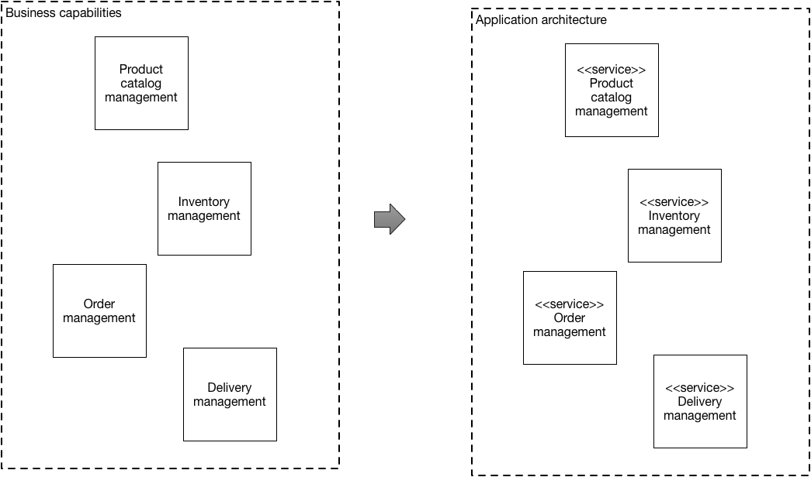

# Шаблон: Декомпозиция по бизнес-возможностям

[Оригинал](https://microservices.io/patterns/decomposition/decompose-by-business-capability.html)

## Дано

Вы разрабатываете большое сложное приложение и хотите использовать 
[микросервисную архитектуру](../Application-architecture-patterns/pattern-microservice-architecture.md). 
Микросервисная архитектура структурирует приложение как набор слабосвязанных 
сервисов. Цель микросервисной архитектуры — ускорить разработку 
программного обеспечения, обеспечивая непрерывную доставку/развертывание.

Микросервисная архитектура позволяет сделать это двумя способами:

1. Упрощает тестирование и позволяет развертывать компоненты независимо
2. Структурирует отдел, отвечающий за разработку, на несколько небольших 
   (6-10 человек) автономных команд, каждая из которых отвечает за одну 
   или несколько сервисов.

Эти преимущества не гарантируются автоматически. Напротив они могут 
быть достигнуты только путем тщательной функциональной декомпозиции 
приложения на сервисы.

Сервис должен быть достаточно маленьким, чтобы его можно было разработать 
небольшой командой и легко протестировать. Полезной аналогией из 
объектно-ориентированного проектирования (ООП) является принцип единой 
ответственности ([SRP](http://www.objectmentor.com/resources/articles/srp.pdf)).
SRP определяет ответственность класса как причину для изменения и 
утверждает, что у класса должна быть только одна причина для изменения.
Имеет смысл применять SRP как для проектирования сервисов, так и для 
проектирования сервисов, которые являются сцепленными, и реализуют небольшой 
набор сильно связанных функций.

Приложение также должно быть декомпозировано таким образом, чтобы 
большинство новых и измененных требований затрагивали только один сервис.
Это связано с тем, что изменения, влияющие на несколько сервисов, требуют 
координации между несколькими командами, что замедляет разработку.
Еще одним полезным принципом ООП является Common Closure Principle (CCP), 
который гласит, что классы, изменяющиеся по одной и той же причине, должны 
находиться в одном пакете. Например, два класса реализуют разные аспекты 
одного и того же бизнес-правила. Цель состоит в том, чтобы, когда это 
бизнес-правило изменится, разработчикам нужно изменить код только в 
небольшом количестве (в идеале только в одном) пакетов. Такое способ 
мышления имеет смысл и при разработке сервисов, поскольку он поможет 
гарантировать, что каждое изменение будет влиять только на один сервис.

## Задача

Как декомпозировать приложение на сервисы?

## Дополнительные условия

* Архитектура должна быть стабильной
* Сервисы должны быть сцепленными. Сервис должна реализовывать небольшой 
  набор сильно связанных функций.
* Сервисы должны соответствовать Common Closure Principle — то, что  
  изменяется вместе, должно находиться внутри одного пакета — чтобы 
  гарантировать, что каждое изменение влияет только на один сервис.
* Сервисы должны быть слабо связаны — каждый сервис как API, который 
  инкапсулирует его реализацию. Реализация может быть изменена без ущерба 
  для клиентов
* Сервис должен быть тестируемым
* Каждый сервис должен быть достаточно маленьким, чтобы ее разрабатывала 
  команда «на две пиццы», т. е. команда из 6-10 человек.
* Каждая команда, обслуживающая одной или несколько сервисов, должна 
  быть автономной. Команда должна иметь возможность разрабатывать и 
  развертывать свои сервисы, минимально сотрудничая с другими командами.

## Решение

Определить сервисы, соответствующие бизнес-возможностям. Концепция 
бизнес-возможности применяется в моделировании бизнес-архитектур. Она 
обозначает то, из чего бизнес генерирует прибыль. Бизнес-возможность часто 
соответствует бизнес-объекту, например

* _Управление заказами_ отвечает за заказы
* _Управление клиентами_ отвечает за клиентов

Бизнес-возможности часто организованы в многоуровневую иерархию. Например, 
корпоративное приложение может иметь категории верхнего уровня, такие как 
_Разработка продукта/сервиса_, _Предоставление продукта/сервиса_, 
_Формирование спроса_ и т. д.

## Примеры

К бизнес-возможностям интернет-магазина относятся:

* Управление каталогом товаров
* Управление запасами на складах
* Управление заказами
* Управление доставкой
* ...

Проектируемая микросервисная архитектура будет состоять из сервисов,
соответствующих каждой из этих возможностей.

## Преимущества и недостатки

Этот шаблон имеет следующие преимущества:

* Стабильная архитектура, поскольку бизнес-возможности относительно стабильны
* Команды разработчиков являются многопрофильными, автономными и
  организованы с учётом предоставления пользы бизнесу, а не реализации
  технических функций.
* Сервисы сильно сцеплены и слабо связаны

## Проблемы, связанные с использованием данного шаблона

Необходимо решить следующие проблемы:

* **Как определить бизнес-возможности?** Определение бизнес-возможностей и, 
  следовательно, сервисов требует понимания бизнеса. Бизнес-возможности 
  организации определяются путем анализа цели, структуры, бизнес-процессов 
  и областей знаний организации. Ограниченные контексты лучше всего 
  идентифицируются с помощью итеративного процесса. Хорошими отправными 
  точками для определения бизнес-возможностей являются:
  * структура организации — разные группы внутри организации могут 
    соответствовать бизнес-возможностям или группам бизнес-возможностей.
  * модель предметной области высокого уровня — бизнес-возможности часто 
    соответствуют объектам предметной области

## Связанные шаблоны

[Декомпозиция по подобластям, основанная на предметно-ориентированном
проектировании](decompose-by-subdomain.md), является альтернативным шаблоном.