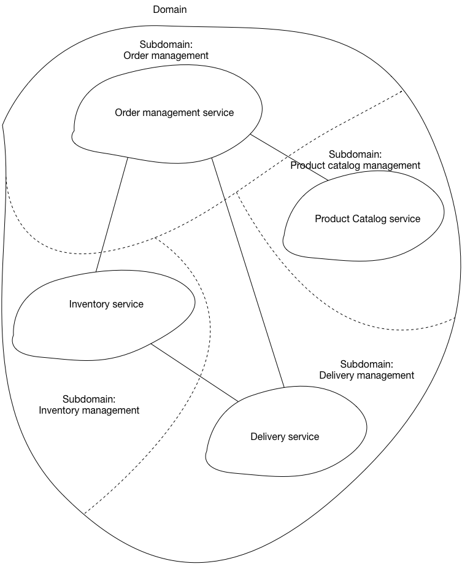

# Шаблон: Декомпозиция по подобластям, основанная на предметно-ориентированном проектировании

[Оригинал](https://microservices.io/patterns/decomposition/decompose-by-subdomain.html)

## Дано

Вы разрабатываете большое сложное приложение и хотите использовать
[микросервисную архитектуру](../Application-architecture-patterns/pattern-microservice-architecture.md).
Микросервисная архитектура структурирует приложение как набор слабосвязанных
сервисов. Цель микросервисной архитектуры — ускорить разработку
программного обеспечения, обеспечивая непрерывную доставку/развертывание.

1. Упрощает тестирование и позволяет развертывать компоненты независимо
2. Структурирует отдел, отвечающий за разработку, на несколько небольших
   (6-10 человек) автономных команд, каждая из которых отвечает за одну
   или несколько сервисов.

Эти преимущества не гарантируются автоматически. Напротив они могут
быть достигнуты только путем тщательной функциональной декомпозиции
приложения на сервисы.

Сервис должен быть достаточно маленьким, чтобы его можно было разработать
небольшой командой и легко протестировать. Полезной аналогией из
объектно-ориентированного проектирования (ООП) является принцип единой
ответственности ([SRP](http://www.objectmentor.com/resources/articles/srp.pdf)).
SRP определяет ответственность класса как причину для изменения и
утверждает, что у класса должна быть только одна причина для изменения.
Имеет смысл применять SRP как для проектирования сервисов, так и для
проектирования сервисов, которые являются сцепленными, и реализуют небольшой
набор сильно связанных функций.

Приложение также должно быть декомпозировано таким образом, чтобы
большинство новых и измененных требований затрагивали только один сервис.
Это связано с тем, что изменения, влияющие на несколько сервисов, требуют
координации между несколькими командами, что замедляет разработку.
Еще одним полезным принципом ООП является Common Closure Principle (CCP),
который гласит, что классы, изменяющиеся по одной и той же причине, должны
находиться в одном пакете. Например, два класса реализуют разные аспекты
одного и того же бизнес-правила. Цель состоит в том, чтобы, когда это
бизнес-правило изменится, разработчикам нужно изменить код только в
небольшом количестве (в идеале только в одном) пакетов. Такое способ
мышления имеет смысл и при разработке сервисов, поскольку он поможет
гарантировать, что каждое изменение будет влиять только на один сервис.

## Задача

Как декомпозировать приложение на сервисы?

## Дополнительные условия

* Архитектура должна быть стабильной
* Сервисы должны быть сцепленными. Сервис должна реализовывать небольшой
  набор сильно связанных функций.
* Сервисы должны соответствовать Common Closure Principle — то, что  
  изменяется вместе, должно находиться внутри одного пакета — чтобы
  гарантировать, что каждое изменение влияет только на один сервис.
* Сервисы должны быть слабо связаны — каждый сервис как API, который
  инкапсулирует его реализацию. Реализация может быть изменена без ущерба
  для клиентов
* Сервис должен быть тестируемым
* Каждый сервис должен быть достаточно маленьким, чтобы ее разрабатывала
  команда «на две пиццы», т. е. команда из 6-10 человек.
* Каждая команда, обслуживающая одной или несколько сервисов, должна
  быть автономной. Команда должна иметь возможность разрабатывать и
  развертывать свои сервисы, минимально сотрудничая с другими командами.

## Решение

Определить сервисы, соответствующие подобластям, используя 
предметно-ориентированное проектирование. Предметно-ориентированное 
проектирование определяет задачи, которые решает приложение — бизнес — как 
предметную область. Предметная область состоит из нескольких подобластей.
Каждая подобласть соответствует какой-то части бизнеса.

Подобласти можно классифицировать следующим образом:

* Смысловое ядро — определяет ключевое отличие бизнеса от других и является 
  самой ценной частью приложения.
* Вспомогательные — связаны с тем, чем занимается бизнес, но не является 
  отличительной чертой. Они могут быть реализованы внутри компании или 
  переданы на аутсорсинг.
* Общие — не специфичные для бизнеса и в идеале реализуются с помощью 
  готового программного обеспечения.

## Примеры

К подобластям интернет-магазина относятся:

* Каталог товаров
* Управление запасами на складах
* Управление заказами
* Управление доставкой
* ...
  
Проектируемая микросервисная архитектура будет состоять из сервисов,
соответствующих каждой из этих подобластей.

## Преимущества и недостатки

Этот шаблон имеет следующие преимущества:

* стабильная архитектура, поскольку подобласти относительно стабильны
* Команды разработчиков являются многопрофильными, автономными и
  организованы с учётом предоставления пользы бизнесу, а не реализации
  технических функций.
* сервисы сильно сцеплены и слабо связаны

## Проблемы, связанные с использованием данного шаблона

Необходимо решить следующие проблемы:

* **Как определить подобласти?** Определение подобластей и следовательно, 
  сервисов требует понимания бизнеса. Как и бизнес-возможности, подобласти
  определяются путем анализа бизнеса и его организационной структуры и 
  определения различных областей знаний. Подобласти лучше всего 
  идентифицировать с помощью итеративного процесса. Хорошими отправными
  точками для определения подобластей являются:
  * структура организации — разные группы внутри организации могут
    соответствовать подобластям.
  * модель предметной области высокого уровня — подобласти часто содержат
    один из ключевых объектов предметной области 

## Связанные шаблоны

[Декомпозиция по бизнес-возможностям](decompose-by-business-capability.md), 
является альтернативным шаблоном.