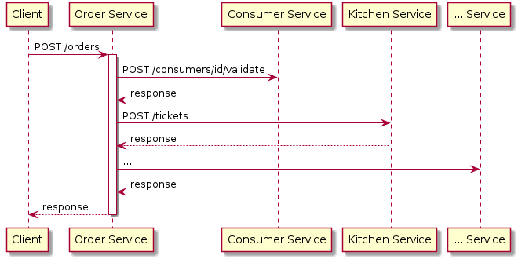
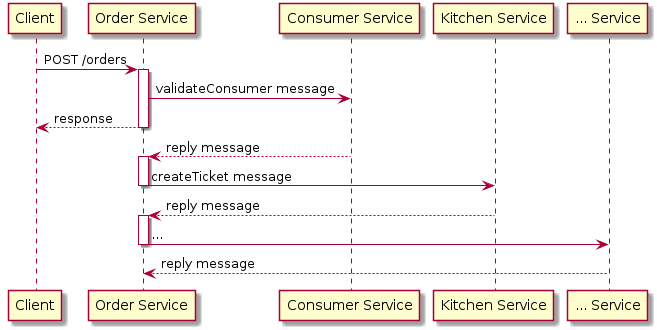
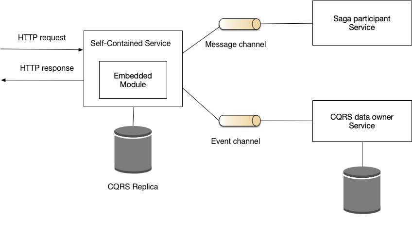

# Самодостаточный сервис

[Оригинал](https://microservices.io/patterns/decomposition/self-contained-service.html)

## Дано

Рассмотрим приложение FTGO, которое представляет собой онлайн-приложение 
для доставки еды. Клиент приложения создает заказ, отправляя HTTP запрос 
`POST /orders`, и ожидает ответа, скажем, в течение 600 мс. Поскольку 
приложение FTGO использует микросервисную архитектуру, обязанности по 
созданию заказов распределены между несколькими сервисами. Запрос POST 
сначала направляется в `Order Service` (сервис управления заказами), который
затем должен взаимодействовать со следующими сервисами:

* `Restaurant Service` (Сервис управления рестораном) — содержит информацию 
  о меню и ценах ресторана
* `Consumer Service` (Сервис для работы с пользователями) — содержит информацию
  о пользователе, размещающего заказ
* `Kitchen Service` (Сервис для работы с кухней) — создает `Ticket`, который 
  сообщает шеф-повару, что готовить
* `Accounting Service` (Сервис для работы с бухгалтерией) — взаимодействует с
  кредитной картой пользователя

`Order Service` может вызывать каждый из этих сервисов, используя синхронный 
запрос/ответ. Например, он может реализовать межсервисное взаимодействие с 
помощью REST или gRPC.

Однако основным недостатком использования синхронного запроса/ответа 
является то, что он снижает доступность сервиса. Это связано с тем, что 
если какой-либо из сервисов, с которым взаимодействует `Order Service` 
недоступен, он не сможет создать заказ и должен вернуть клиенту ошибку.

Альтернативный подход заключается в устранении какой-либо синхронной связи
между `Order Service` и сервисами, с которыми он взаимодействует, с помощью 
шаблонов CQRS и Saga. `Order Service` может использовать [шаблон CQRS](../../Data-management/cqrs.md)
для сохранения у себя копии меню ресторана и тем самым устранить 
необходимость синхронного получения данных из `Restaurant Service`. Он может
проверять заказ асинхронно, используя [шаблон Saga](../../Data-management/saga.md).
`Order Service` создает заказ в состоянии `PENDING` и отправляет результат на
`POST /order`. Затем он завершает создание заказа, взаимодействуя асинхронно 
с другими сервисами.

Ключевым преимуществом этого подхода является то, что он повышает 
доступность. `Order Service` всегда отвечает на запрос `POST /orders`, даже 
если какой-то другой сервис недоступен. Однако единственным недостатком 
использования саги для завершения создания заказа является то, что в ответе 
на POST запрос не сообщается клиенту, был ли заказ успешно обработан. 
Клиент сам должен определить это, периодически вызывая `GET /orders/{orderId}`.

## Задача

Как сервис должна взаимодействовать с другими сервисами при обработке 
синхронного запроса?

## Дополнительные условия

* Микросервисная архитектура часто распределяет ответственность за 
  обработку запроса между несколькими сервисами.
* Обычно требуется, чтобы операция была высокодоступной с малым временем отклика.
* Доступность операции равна произведению доступности сервисов, которые 
  вызываются при обработке запроса или в случае если доступность всех сервисов
  одинакова: доступность сервиса, возведённая в степень числа синхронно 
  взаимодействующих сервисов
* Сервис может повторно отправить запрос сервису, у которого произошёл сбой,
  но это увеличивает время ответа

## Решение

Спроектируйте сервис так, чтобы он мог выдавать результат на синхронный 
запрос, не дожидаясь ответа от какой-либо другого сервиса.

Один из способов сделать сервис самодостаточным — реализовать необходимые функции 
в виде сервисного модуля, а не отдельного сервиса. Мы могли бы, например, 
объединить сервис `Order Service` и `Restaurant Service`.

Другой способ сделать сервис самодостаточным — обеспечить его взаимодействие с
другими сервисами с помощью шаблонов [CQRS](../../Data-management/cqrs.md)
и [Saga](../../Data-management/saga.md). Самодостаточный сервис использует 
шаблон Saga для асинхронной поддержки согласованности данных. Он использует 
шаблон CQRS для репликации данных, принадлежащих другим сервисам.

## Пример

`Order Service` в приложении FTGO, описанная ранее, является 
примером самодостаточного сервиса. Например, операция `createOrder() `
считывает CQRS реплику данных, принадлежащую `Restaurant Service`, для 
проверки заказа и выставления счёта, а затем инициирует сагу, чтобы завершить
оформление заказа.

## Преимущества и недостатки

Этот шаблон имеет следующие преимущества:

* Улучшенная доступность и время отклика
* 
Этот шаблон имеет следующие недостатки:

* Увеличение стоимости и сложности из-за использования CQRS
* Повышенная сложность из-за использования саг
* Менее простой API при использовании саг
* Сервис больше по размеру из-за того, что функционал реализован в сервисе, а 
  не в виде отдельного сервиса

## Связанные шаблоны

* [Микросервисная архитектура](../Application-architecture-patterns/pattern-microservice-architecture.md) создает
  необходимость использования этого шаблона
* [Сага](../../Data-management/saga.md) — используется самодостаточным сервисом 
  для асинхронной поддержки согласованности данных
* [CQRS](../../Data-management/cqrs.md) — используется самодостаточным сервисом 
  для репликации данных, принадлежащих другим сервисам