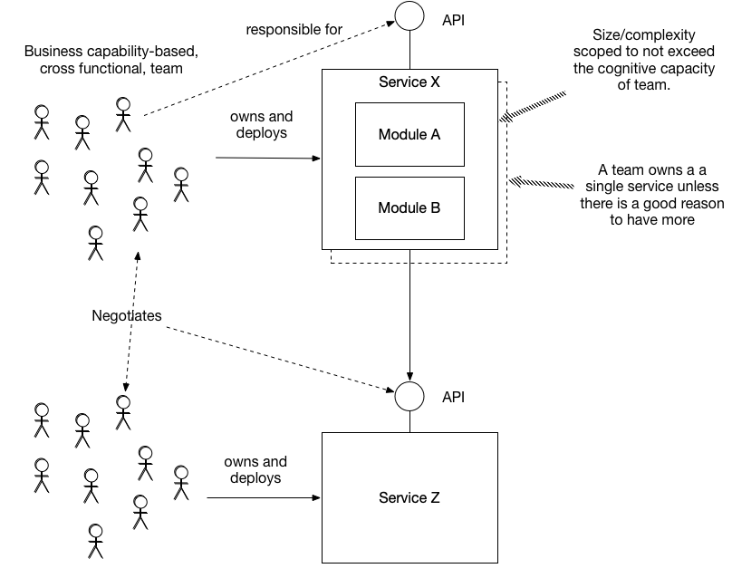

# По команде на сервис

[Оригинал](https://microservices.io/patterns/decomposition/service-per-team.html)

## Дано

Высокопроизводительная организация, занимающаяся разработкой, состоящая из 
нескольких команд. Каждая команда долговременная, небольшая (обычно 5-9 
человек), слабосвязанная, автономная и многопрофильная. Согласно [закону 
Конвея](https://en.wikipedia.org/wiki/Conway%27s_law), архитектура 
отражает коммуникационную структуру организации, которая её создаёт. 
Следовательно, организация, состоящая из слабо связанных команд, нуждается 
в слабо связанной архитектуре.

Одной из таких слабосвязанных архитектур является [микросервисная 
архитектура](../Application-architecture-patterns/pattern-microservice-architecture.md). Это 
стиль приложения, который структурирует приложение как слабосвязанный набор 
сервисов. [Декомпозиция по подобластям](decompose-by-subdomain.md) и 
[Декомпозиция по бизнес-возможностям](decompose-by-business-capability.md) — это 
шаблоны для разбиения на сервисы и организации их вокруг бизнес-функций. Но 
каким должно быть взаимоотношение между сервисами и командами?

Один из подходов — это модель совместного владения, при которой несколько 
команд работают над каждым сервисом по мере необходимости. Например, каждая
команда может отвечать за реализацию функций, охватывающих несколько 
сервисов. С одной стороны, такой подход позволяет командам учесть опыт
пользователя. Но, с другой стороны, это увеличивает количество необходимой 
координации между командами. Кроме того, отсутствие ответственности
за написанный код увеличивает риск его низкого качества.

Гораздо лучше использовать подход, повышающий автономию команды и слабую 
связанность, — это модель владения кодом/сервисом. Команда, отвечающая 
за бизнес-функцию/возможность, владеет кодовой базой, которую они 
развертывают как один или несколько сервисов. В результате команда может 
свободно разрабатывать, тестировать, развертывать и масштабировать свои 
сервисы. Они взаимодействуют с другими командами главным образом для 
согласования API.

В идеале команда должна владеть только одним сервисом, поскольку этого 
достаточно для обеспечения автономности команды и слабой связанности, а 
каждый дополнительный сервис добавляет сложности и накладных расходов. 
Команде следует развертывать свой код как несколько сервисов только в том 
случае, если он решает осязаемую проблему, например значительно сокращает 
время выполнения заказа или улучшает масштабируемость либо отказоустойчивость.

Поскольку команда должна быть небольшой, ее когнитивные способности 
ограничены. Чтобы команда была продуктивной, объем её кодовой базы не 
должен превышать когнитивные способности команды. Другими словами, он 
должен «умещаться» в головах команды. В результате существует верхняя 
граница размера и/или сложности сервиса.

## Задача

Каким должно быть взаимоотношение между командами и сервисами?

## Дополнительные условия

* Команда должна быть небольшой, т.е. состоять из 5-9 человек
* Команда должна быть автономной и слабо связанной
* Размер и сложность кодовой базы команды не должны превышать когнитивные 
  способности команды
* Более детальная декомпозиция сервисов улучшает возможности, включая 
  поддержку, тестируемость и возможность развертывания
* Более детальная декомпозиция сервисов делает их более сложными

## Решение

Каждый сервис принадлежит команде, которая несет единоличную 
ответственность за внесение изменений. В идеале каждая команда работает 
только с одним сервисом:

Каждая команда отвечает за одну или несколько бизнес-функций (например, 
бизнес-возможности). Команда владеет (несет единоличную ответственность за 
изменение) кодовой базой, состоящей из одного или нескольких модулей. Размер
кодовой базы рассчитан таким образом, чтобы не превышать когнитивные 
возможности команды. Команда развертывает свой код как один или несколько 
сервисов. Команда должна отвечать только за один сервис, если нет доказанной 
необходимости нести ответственность за несколько.

## Преимущества и недостатки

Этот шаблон имеет следующие преимущества:

* Позволяет каждой команде быть автономной и работать с минимальной 
  координацией с другими командами
* Позволяет командам быть слабо связанными
* Достигает командной автономии и слабой связанности с минимальным 
  количеством сервисов
* Улучшает качество кода благодаря долговременной ответственности за 
  написанный код

Этот шаблон имеет следующие недостатки:

* Команды необязательно соответствуют функционалу, необходимому конечному 
  пользователю
* Реализация функционала, охватывающих сервисы, более сложная и требует 
  совместной работы команд

## Связанные шаблоны

* [Микросервисная архитектура](../Application-architecture-patterns/pattern-microservice-architecture.md) создает
  необходимость использования этого шаблона
* [Декомпозиция по подобластям](decompose-by-subdomain.md) и
  [Декомпозиция по бизнес-возможностям](decompose-by-business-capability.md) — это
  шаблоны для разбиения на сервисы