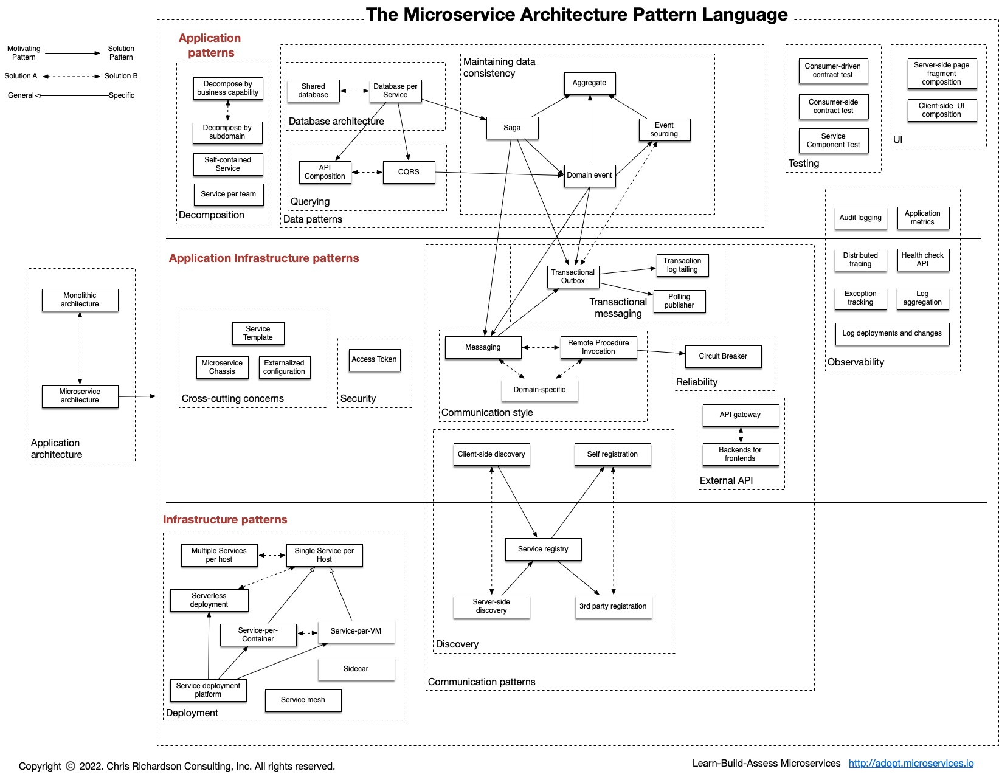

# Язык шаблонов для микросервисов

[Оригинал](https://microservices.io/patterns/index.html)

Отправная точка [языка шаблонов](https://en.wikipedia.org/wiki/Pattern_language) 
для микросервисных архитектур.

[Скачать в PDF формате](https://microservices.io/i/MicroservicePatternLanguage.pdf)

## Шаблоны архитектур приложений

Какую архитектуру выбрать для приложения?

* [Монолитная архитектура](Patterns/Application-architecture-patterns/pattern-monolithic-architecture.md) — позволяет 
  спроектировать приложение как единую развертываемую единицу.
* [Микросервисная архитектура](Patterns/Application-architecture-patterns/pattern-microservice-architecture.md) — позволяет 
  спроектировать приложение как набор слабо связанных сервисов.

## Декомпозиция 

Как декомпозировать приложение на сервисы?

* [Декомпозиция по бизнес-возможностям](Patterns/Decomposition/decompose-by-business-capability.md) - определяет сервисы, соответствующие бизнес-возможностям
* [Декомпозиция по подобластям, основанная на предметно-ориентированном
  проектировании](Patterns/Decomposition/decompose-by-subdomain.md) — определяет сервисы, 
  соответствующие подобластям, используя предметно-ориентированное проектирование 
* [Самодостаточный сервис](Patterns/Decomposition/self-contained-service.md) — позволяет 
  проектировать сервисы для обработки синхронных запросов, не дожидаясь ответа 
  других сервисов (новинка)
* [По команде на сервис](Patterns/Decomposition/service-per-team.md) (новинка)

## Постепенный рефакторинг к микросервисной архитектуре (новинка)

* [Шаблон «Удушитель»](Patterns/Refactoring-to-microservices/strangler-application.md)
* [Предохранительный уровень](Patterns/Refactoring-to-microservices/anti-corruption-layer.md)

## Управление данными

Как обеспечить согласованность данных и реализовывать запросы?

* [По базе данных на сервис](Patterns/Data-management/database-per-service.md) — каждый
  сервис имеет свою собственную базу данных
* [Общая база данных](Patterns/Data-management/shared-database.md) — сервисы 
  используют общую базу данных
* [Сага](Patterns/Data-management/saga.md) — используйте саги, представляющие собой 
  последовательности локальных транзакций, для обеспечения согласованности 
  данных между сервисами
* [Композиция API](Patterns/Data-management/api-composition.md) — реализуйте запросы, 
  вызывая сервисы, которым принадлежат данные, и выполняйте объединение в памяти
* [CQRS](Patterns/Data-management/cqrs.md) — реализуйте запросы, поддерживая одно или 
  несколько материализованных представлений, которые можно эффективно опрашивать
* [Событие предметной области](Patterns/Data-management/domain-event.md) — публикуйте 
  событие при каждом изменении данных
* [Генерация событий](Patterns/Data-management/event-sourcing.md) — сохраняйте 
  агрегаты как последовательность событий

## Транзакционные сообщения

Как опубликовать сообщения как часть транзакции базы данных?

* [Таблица исходящих транзакций](Patterns/Transactional-messaging/transactional-outbox.md)
* [Отслеживание лога транзакций](Patterns/Transactional-messaging/transaction-log-tailing.md)
* [Отправка сообщений путём опрашивания](Patterns/Transactional-messaging/polling-publisher.md)

## Тестирование

Как упростить тестирование?

* [Тестирование сервиса с использованием контракта, проверяющего отвечает ли
  он ожиданиям потребителя](Patterns/Testing/service-integration-contract-test.md) — набор 
  тестов для сервиса, написанный разработчиками другого сервиса, который его 
  использует
* [Тестирование сервиса с использованием контракта на стороне потребителя](Patterns/Testing/consumer-side-contract-test.md) — набор
  тестов для клиента сервиса (например, другого сервиса), который проверяет, 
  может ли он взаимодействовать с сервисом
* [Компонентное тестирование сервиса](Patterns/Testing/service-component-test.md) — набор 
  тестов, который тестирует сервис изолированно, используя тестовые «двойники» 
  для любых сервисов, вызываемых ею

## Шаблоны развёртывания

Как развернуть сервисы приложения?

* [Несколько экземпляров сервиса на хосте](Patterns/Deployment-patterns/multiple-services-per-host.md) — разверните несколько экземпляров 
  сервиса на одном хосте
* [По сервису на хосте](Patterns/Deployment-patterns/single-service-per-host.md) — разверните 
  каждый экземпляр сервиса на своём хосте
* [По сервису на виртуальной машине](Patterns/Deployment-patterns/service-per-vm.md) — разверните 
  каждый экземпляр сервиса на своей виртуальной машине
* [По сервису на контейнер](Patterns/Deployment-patterns/service-per-container.md) — разверните 
  каждый экземпляр сервиса в своём контейнере
* [Бессерверное развертывание](Patterns/Deployment-patterns/serverless-deployment.md) — разверните 
  сервис с помощью бессерверной платформы развертывания
* [Платформа для развёртывания сервиса](Patterns/Deployment-patterns/service-deployment-platform.md) — разверните 
  сервис с помощью высокоавтоматизированной платформы развертывания, 
  обеспечивающей абстракцию сервисов

## Понятия, затрагивающие несколько областей

Как решать проблемы, затрагивающие несколько областей?

* [Микросервисное шасси](Patterns/Cross-cutting-concerns/microservice-chassis.md) — фреймворк, 
  которая решает проблемы, затрагивающие несколько областей, и упрощает 
  разработку сервисов
* [Внешняя конфигурация](Patterns/Cross-cutting-concerns/service-template.md) — выносит 
  все настройки, такие как расположение базы данных и учетные данные
* [Готовый шаблон сервиса](Patterns/Cross-cutting-concerns/externalized-configuration.md) — шаблон, 
  который решает проблемы, затрагивающие несколько областей, и предназначен 
  для копирования разработчиком, чтобы быстро приступить к разработке нового
  сервиса

## Шаблоны взаимодействия

### По стилю

Какие механизмы взаимодействия используют сервисы для связи друг с другом и 
их внешними клиентами?

* [Удаленный вызов процедуры](Patterns/Communication-style/rpi.md) — используйте 
  протокол на основе RPI для межсервисного взаимодействия
* [Обмен сообщениями](Patterns/Communication-style/messaging.md) — используйте 
  асинхронный обмен сообщениями для межсервисного взаимодействия
* [Протокол, специфичный для предметной области](Patterns/Communication-style/domain-specific-protocol.md) — используйте 
  протокол, специфичный для предметной области
* [Идемпотентный потребитель](Patterns/Communication-style/idempotent-consumer.md) — убедитесь, 
  что потребители сообщений правильно работают, когда они вызываются 
  множество раз и им передаётся одно и то же сообщение 

### C внешним API

Как внешние клиенты взаимодействуют с сервисами?

* [API-шлюз](Patterns/External-API/api-gateway.md) — сервис, предоставляющий каждому 
  клиенту унифицированный интерфейс к сервисам
* [Бэкенд для фронтенда](Patterns/External-API/api-gateway.md) — отдельный API-шлюз 
  для каждого типа клиентов

### По обнаружению сервиса

Как клиент сервиса на основе RPI обнаруживает сетевое расположение экземпляра 
сервиса?

* [Обнаружение на стороне клиента](Patterns/Service-discovery/client-side-discovery.md) — клиент 
  опрашивает реестр сервисов, чтобы обнаружить, где находятся экземпляры сервиса
* [Обнаружение на стороне сервера](Patterns/Service-discovery/server-side-discovery.md) — маршрутизатор 
  опрашивает реестр сервисов, чтобы обнаружить, где находятся экземпляры сервиса
* [Реестр сервисов](Patterns/Service-discovery/service-registry.md) — база данных с 
  местоположениями экземпляров сервисов
* [Самостоятельная регистрация](Patterns/Service-discovery/self-registration.md) — экземпляр 
  сервиса регистрируется в реестре сервисов
* [Регистрация с помощью третьих лиц](Patterns/Service-discovery/3rd-party-registration.md) — третье 
  лицо регистрирует экземпляр сервиса в реестре сервисов

### С учётом надёжности

Как сделать так, чтобы сбой сети или сервиса не привёл к каскадному обрушению
других, связанных с ним сервисов?

* [Шаблон Circuit Breaker](Patterns/Reliability/circuit-breaker.md) — вызывайте 
  удалённый сервис через прокси-сервер, который сразу же выдаст ошибку, 
  если частота сбоев удаленного вызова превышает пороговое значение

## Безопасность

Как передать информацию о том кто именно был инициатором запроса, 
обрабатываемого сервисами?

* [Токен доступа](Patterns/Security/access-token.md) — токен, надежно хранящий 
  информацию о пользователе, которым обмениваются сервисы

## Наблюдаемость

Как понять правильно ли себя ведёт приложение и устранить неполадки?

* [Агрегация логов](Patterns/Observability/log-aggregation.md) — агрегируйте логи приложений
* [Метрики приложения](Patterns/Observability/application-metrics.md) — добавьте в 
  код сервиса инструменты для сбора статистики об операциях
* [Ведение лога аудита](Patterns/Observability/audit-logging.md) — пишите активности 
  пользователя в базу данных
* [Распределенная трассировка](Patterns/Observability/distributed-tracing.md) — добавьте 
  в сервис код, присваивающий каждому внешнему запросу уникальный 
  идентификатор, который передается между сервисами. Запишите информацию 
  (например, время начала, время окончания) о работе (например, запросы 
  сервиса), выполненной при обработке внешнего запроса в централизованном 
  сервисе
* [Отслеживание исключений](Patterns/Observability/exception-tracking.md) — сообщайте 
  обо всех исключениях в централизованный сервис отслеживания исключений, 
  который собирает и отслеживает исключения и уведомляет разработчиков
* [API проверки работоспособности](Patterns/Observability/health-check-api.md) — API 
  сервиса (например, конечная точка HTTP), который возвращает информацию 
  о работоспособности сервиса и пингуется, например, сервисом мониторинга
* [Лог развертываний и изменений](Patterns/Observability/log-deployments-and-changes.md)

## Шаблоны пользовательского интерфейса

Как реализовать экран или страницу пользовательского интерфейса, отображающую 
данные от нескольких сервисов?

* [Композиция фрагмента страницы на стороне сервера](Patterns/UI-patterns/server-side-page-fragment-composition.md) — создаём 
  веб-страницу на сервере, собирая вместе HTML фрагменты, сгенерированные 
  несколькими веб-приложениями, специфичными для бизнеса/подобласти
* [Композиция пользовательского интерфейса на стороне клиента](Patterns/UI-patterns/client-side-ui-composition.md) — создаём 
  пользовательский интерфейс на клиенте, собирая вместе фрагменты 
  пользовательского интерфейса, которые генерируются несколькими компонентами 
  пользовательского интерфейса, зависящими от бизнес-возможностей/подобластей