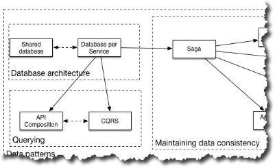

# Изменения в шаблонах данных

[Оригинал](https://microservices.io/microservices/news/2017/07/24/revised-data-patterns.html)

Я внес несколько важных изменений в шаблоны управления данными:

* Устарел [шаблон Архитектура, управляемая событиями](Patterns/Data-management/event-driven-architecture.md)
* Добавлен [шаблон Сага](Patterns/Data-management/saga.md), который является 
  преемником [По базе данных на сервис](Patterns/Data-management/database-per-service.md) и 
  отражает реальное назначение шаблона архитектуры, управляемой событиями
* Добавлен шаблон [Композиция API](Patterns/Data-management/api-composition.md), который 
  является альтернативой [шаблону CQRS](Patterns/Data-management/cqrs.md)
* [Шаблон CQRS](Patterns/Data-management/cqrs.md) и шаблон [Композиция API](Patterns/Data-management/api-composition.md) являются 
  преемниками [По базе данных на сервис](Patterns/Data-management/database-per-service.md), а 
  не [шаблона Генерация событий](Patterns/Data-management/event-sourcing.md)

Эти изменения должным образом отображены в языке шаблонов моей книги
[Микросервисы. Паттерны разработки и рефакторинга](https://microservices.io/book)