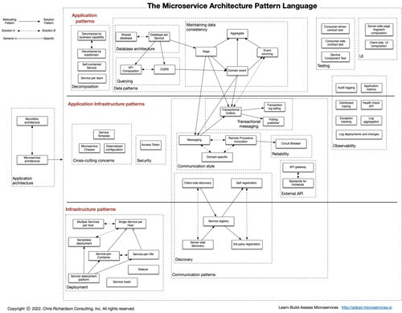
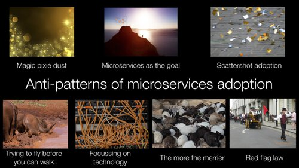

# Что такое микросервисы?

[Оригинал](https://microservices.io/index.html)

Микросервисы (микросервисная архитектура) представляют собой архитектурный 
стиль, структурирующий приложение как набор сервисов, которые

* легко поддерживать и тестировать
* слабосвязанные
* независимо развертываются
* организованы согласно требованиям бизнеса
* разрабатываются небольшой командой

Микросервисная архитектура позволяет быстро и надежно создавать большие и 
сложные приложения. Это также позволяет организации развивать свой 
технологический стек.

## Язык шаблонов микросервисной архитектуры

Микросервисная архитектура — это не панацея. Он имеет некоторые недостатки.
Более того, при использовании этой архитектуры возникает множество проблем, 
которые необходимо решить.

Язык шаблонов микросервисной архитектуры — это набор шаблонов, применяемых в
микросервисной архитектуре. Они используются для двух целей:

1. Позволяют решить, подходят ли микросервисы для вашего приложения.
2. Позволяют успешно использовать микросервисную архитектуру.

Хорошей отправной точкой является шаблон монолитной архитектуры, 
представляющий собой традиционный архитектурный стиль, который до сих пор 
является хорошим выбором для многих приложений. Однако он имеет множество 
ограничений и проблем, поэтому лучшим выбором для больших/сложных 
приложений является шаблон микросервисной архитектуры.

## Избегаем подводных камней

Думаете о переходе на микросервисную архитектуру? Если да, то вам стоит 
посмотреть эту презентацию о [подводных камнях при переходе от монолитной к 
микросервисной архитектуре]() и прочитать этот [набор постов в блоге]() об 
антипаттернах и о том, как их избежать.

## Оцените свою архитектуру

Если вы создали приложение с микросервисной архитектурой, взгляните на эту 
[Платформу для оценки микросервисов](https://microservices.io/platform/microservice-architecture-assessment.html).
Платформа оценивает то, что вы создали, и определяет, что нужно улучшить. 
Это снижает архитектурные и организационные риски и позволит по максимуму 
воспользоваться преимуществами микросервисной архитектуры.

### Примеры микросервисных приложений

Хотите увидеть пример? Ознакомьтесь с примерами денежных переводов и 
канбан-досок Криса Ричардсона.

[Смотреть код](http://eventuate.io/exampleapps.html)

### Как применять язык шаблонов

Статья, описывающая, как разработать микросервисную архитектуру, применяя 
шаблоны

[Подробнее](Articles/applying-the-microservice-architecture-pattern-language.md)

### Внедрение микросервисов: Кто использует микросервисы?

Многие компании либо используют микросервисы, либо рассматривают возможность 
их использования. Узнайте о реальных случаях...

[Подробнее](Articles/who-is-using-microservices.md)

### Новые и обновленные обучающие материалы

Изучите важные темы, такие как декомпозиция и проектирование сервисов и
Kubernetes.

[Подробнее](new-and-revised-classes.md)

### Изменения в шаблонах данных

Ознакомьтесь с изменениями в шаблонах данных

[Подробнее](revised-data-patterns.md)

## Шаблоны

[Как применять шаблоны](Articles/applying-the-microservice-architecture-pattern-language.md)

Шаблоны архитектур приложений

* [Монолитная архитектура](Patterns/Application-architecture-patterns/pattern-monolithic-architecture.md)
* [Микросервисная архитектура](Patterns/Application-architecture-patterns/pattern-microservice-architecture.md)

Декомпозиция

* [Декомпозиция по бизнес-возможностям](Patterns/Decomposition/decompose-by-business-capability.md)
* [Декомпозиция по подобластям, основанная на предметно-ориентированном 
  проектировании](Patterns/Decomposition/decompose-by-subdomain.md)
* [Самодостаточный сервис](Patterns/Decomposition/self-contained-service.md) (новинка)
* [По команде на сервис](Patterns/Decomposition/service-per-team.md) (новинка)

Постепенный рефакторинг к микросервисной архитектуре (новинка)

* [Шаблон «Удушитель»](Patterns/Refactoring-to-microservices/strangler-application.md)
* [Предохранительный уровень](Patterns/Refactoring-to-microservices/anti-corruption-layer.md)

Управление данными

* [По базе данных на сервис](Patterns/Data-management/database-per-service.md)
* [Общая база данных](Patterns/Data-management/shared-database.md)
* [Сага](Patterns/Data-management/saga.md)
* [Композиция API](Patterns/Data-management/api-composition.md)
* [CQRS](Patterns/Data-management/cqrs.md)
* [Событие предметной области](Patterns/Data-management/domain-event.md)
* [Генерация событий](Patterns/Data-management/event-sourcing.md)

Транзакционные сообщения

* [Таблица исходящих транзакций](Patterns/Transactional-messaging/transactional-outbox.md)
* [Отслеживание лога транзакций](Patterns/Transactional-messaging/transaction-log-tailing.md)
* [Отправка сообщений путём опрашивания](Patterns/Transactional-messaging/polling-publisher.md)

Тестирование

* [Компонентное тестирование сервиса](Patterns/Testing/service-component-test.md)
* [Тестирование сервиса с использованием контракта, проверяющего отвечает ли 
  он ожиданиям потребителя](Patterns/Testing/service-integration-contract-test.md)
* [Тестирование сервиса с использованием контракта на стороне потребителя](Patterns/Testing/consumer-side-contract-test.md)

Шаблоны развёртывания

* [Несколько экземпляров сервиса на хосте](Patterns/Deployment-patterns/multiple-services-per-host.md)
* [По сервису на хосте](Patterns/Deployment-patterns/single-service-per-host.md)
* [По сервису на виртуальной машине](Patterns/Deployment-patterns/service-per-vm.md)
* [По сервису на контейнер](Patterns/Deployment-patterns/service-per-container.md)
* [Бессерверное развёртывание](Patterns/Deployment-patterns/serverless-deployment.md)
* [Платформа для развёртывания сервиса](Patterns/Deployment-patterns/service-deployment-platform.md)

Понятия, затрагивающие несколько областей

* [Микросервисное шасси](Patterns/Cross-cutting-concerns/microservice-chassis.md)
* [Готовый шаблон сервиса](Patterns/Cross-cutting-concerns/service-template.md)
* [Внешняя конфигурация](Patterns/Cross-cutting-concerns/externalized-configuration.md)

Способы взаимодействия

* [Удаленный вызов процедуры](Patterns/Communication-style/rpi.md)
* [Обмен сообщениями](Patterns/Communication-style/messaging.md)
* [Протокол, специфичный для предметной области](Patterns/Communication-style/domain-specific-protocol.md)
* [Идемпотентный потребитель](Patterns/Communication-style/idempotent-consumer.md)

Внешний API

* [API-шлюз](Patterns/External-API/api-gateway.md)
* [Бэкенд для фронтенда](Patterns/External-API/api-gateway.md)
  
Обнаружение сервиса

* [Обнаружение на стороне клиента](Patterns/Service-discovery/client-side-discovery.md)
* [Обнаружение на стороне сервера](Patterns/Service-discovery/server-side-discovery.md)
* [Реестр сервисов](Patterns/Service-discovery/service-registry.md)
* [Самостоятельная регистрация](Patterns/Service-discovery/self-registration.md)
* [Регистрация с помощью третьих лиц](Patterns/Service-discovery/3rd-party-registration.md)

Надежность

* [Шаблон Circuit Breaker](Patterns/Reliability/circuit-breaker.md)

Безопасность

* [Токен доступа](Patterns/Security/access-token.md)

Наблюдаемость

* [Агрегация логов](Patterns/Observability/log-aggregation.md)
* [Метрики приложения](Patterns/Observability/application-metrics.md)
* [Ведение лога аудита](Patterns/Observability/audit-logging.md)
* [Распределенная трассировка](Patterns/Observability/distributed-tracing.md)
* [Отслеживание исключений](Patterns/Observability/exception-tracking.md)
* [API проверки работоспособности](Patterns/Observability/health-check-api.md)
* [Лог развертываний и изменений](Patterns/Observability/log-deployments-and-changes.md)

Шаблоны пользовательского интерфейса

* [Композиция фрагмента страницы на стороне сервера](Patterns/UI-patterns/server-side-page-fragment-composition.md)
* [Композиция пользовательского интерфейса на стороне клиента](Patterns/UI-patterns/client-side-ui-composition.md)